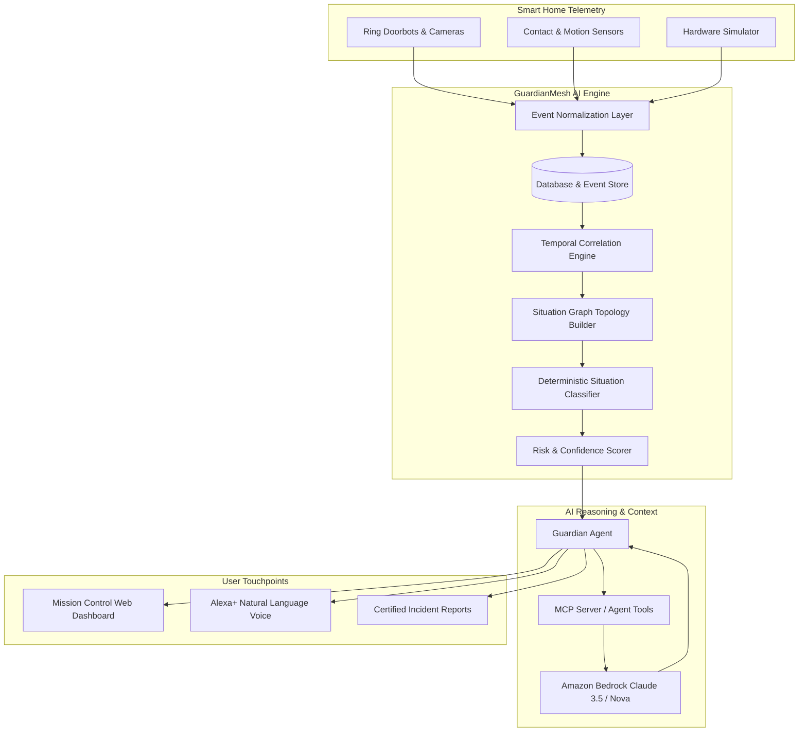
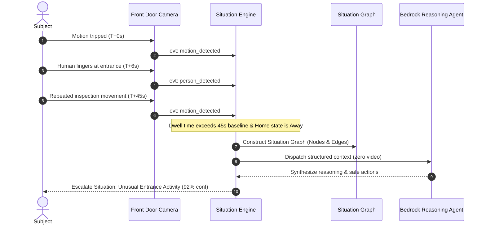
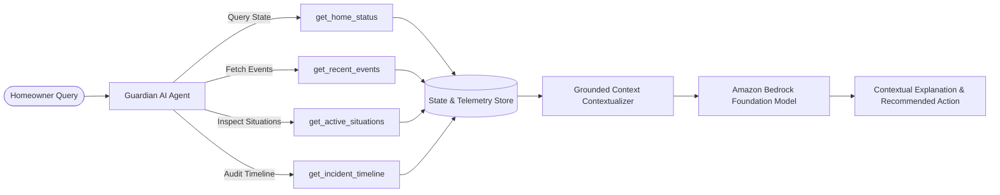
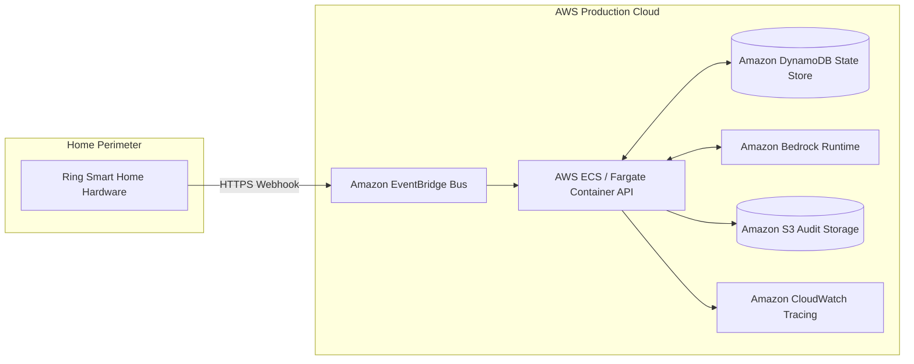

# GuardianMesh AI
> **"From smart-home events to real-world understanding."**

[](LICENSE)
[](https://fastapi.tiangolo.com)
[](https://vitejs.dev)
[](https://aws.amazon.com/bedrock/)
[](https://ring.com)
[](#testing)

---

## Executive Summary
Traditional smart-home systems react to individual, disconnected events:
- *10:41 PM: Motion detected*
- *10:42 PM: Person detected*
- *10:43 PM: Door opened*

The result is alert fatigue, false alarms, and a lack of true situational awareness.

**GuardianMesh AI** transforms raw smart-home telemetry into **real-world understanding**. Instead of reacting to isolated events, GuardianMesh AI calculates the **temporal, spatial, and behavioral relationships between events**:

$$\text{Person Detected} + \text{Prolonged Entrance Dwell} + \text{Repeated Movement} + \text{Home Unoccupied} \implies \mathbf{UNUSUAL\ ENTRANCE\ ACTIVITY}$$

---

## Core Non-Negotiable Principle
**WE DO NOT BUILD: "Ring event → LLM → Response"**

Instead, GuardianMesh AI builds:
$$\mathbf{Ring / Simulator} \to \mathbf{Event\ Normalization} \to \mathbf{Event\ Store} \to \mathbf{Temporal\ Correlation} \to \mathbf{Situation\ Graph} \to \mathbf{Classification} \to \mathbf{AI\ Reasoner} \to \mathbf{Confidence\ Engine} \to \mathbf{Explanation} \to \mathbf{Action} \to \mathbf{Alexa+ / Web}$$

The **Situation Engine** is the core innovation.

---

## Architecture Diagrams

### 1. System Architecture


### 2. Event Pipeline & Correlation Engine


### 3. AI Agent Flow Grounded in MCP Tools


### 4. AWS Cloud Production Architecture


---

## Key Features

1. **Real-Time Event Stream**: Sub-second event ingestion over WebSockets with standard telemetry schemas (`person_detected`, `motion_detected`, `door_opened`, `package_detected`, etc.).
2. **Deterministic Situation Engine**: Mathematical correlation over rolling temporal windows, spatial zoning, and home state context.
3. **Interactive Situation Graph**: Directed graph mapping topological relationships (`caused_by`, `followed_by`, `occurred_near`, `escalated_to`).
4. **AI Reasoning Agent (Amazon Bedrock)**: Generates structured explanations, confidence assessments, and recommended safe actions without hallucinating criminal claims.
5. **Ask Guardian AI**: Conversational interface executing real tools (`get_home_status`, `get_recent_events`, `create_incident_report`) before answering.
6. **Certified Incident Reports**: Downloadable and printable incident summaries with reconstructed timelines and export capabilities.
7. **Proactive Safe Alerting**: Hierarchical risk taxonomy (`INFO`, `LOW`, `MEDIUM`, `HIGH`, `CRITICAL`).
8. **Contextual Home State Engine**: Dynamic weights based on `Home`, `Away`, `Sleep`, and `Guest` modes.
9. **Interactive Simulator**: 6 realistic scenarios (`Unusual Entrance`, `Normal Delivery`, `Visitor Arrival`, `Late-Night Activity`, `False Alarm`, `Device Offline`) with step-by-step telemetry tracers.
10. **Ring Hardware Adapter**: Clean `SmartHomeProvider` abstraction supporting live Ring APIs and simulator parity.
11. **Alexa+ & Model Context Protocol (MCP)**: Native tool integration for Alexa+ voice experiences and AgentCore architectures.
12. **Privacy Center**: Zero raw video transmitted to cloud LLMs. User-controlled retention and full data purge.
13. **Explainable AI**: Visual breakdown of contributing factors and weighted confidence scores.
14. **AI Observability & Cost Analytics**: Real-time token consumption, latency metrics, and CloudWatch tracking.
15. **Developer Console**: End-to-end trace inspector examining each stage from raw telemetry to Bedrock completion.

---

## Tech Stack
- **Frontend**: React 18, TypeScript, Vite, Tailwind CSS, Framer Motion, Recharts, Lucide Icons.
- **Backend**: Python 3.11+, FastAPI, Pydantic v2, SQLAlchemy 2.0 (async), aiosqlite / PostgreSQL, Greenlet.
- **AI / Agentic**: Amazon Bedrock (`anthropic.claude-3-5-sonnet-20241022-v2:0` / `amazon.nova-pro-v1:0`), MCP Server, MockAIProvider.
- **Integrations**: Ring Provider Adapter, Alexa+ Voice Integration Layer.
- **Infrastructure**: Docker, Docker Compose, Terraform, Amazon EventBridge, DynamoDB, S3, CloudWatch.

---

## 60-Second Demo Walkthrough
1. **Open GuardianMesh Dashboard**: Note the top badge: `● HOME PROTECTED (Away Mode)`.
2. **Click DEMO MODE**:
   - Resets state and configures Home to Away mode.
   - Generates sequential entrance telemetry (`motion_detected` → `person_detected` → `repeated_movement`).
   - Situation Engine deterministically correlates events into `UNUSUAL ENTRANCE ACTIVITY` (92% confidence).
3. **Investigate Situation**:
   - Inspect the reconstructed timeline and **Situation Topology Graph**.
   - Examine **Why This Was Detected** contributing factor weights.
4. **Ask Guardian**:
   - Ask *"Why did I get this alert?"*
   - Observe real-time tool executions (`get_home_status`, `get_active_situations`) followed by a grounded response.
5. **View Certified Incident Report**: Inspect audit-ready report ready for PDF export.
6. **Open Developer Console**: Inspect the full end-to-end pipeline trace:
   `EVENT → CORRELATION → SITUATION → AGENT → BEDROCK`

---

## Local Development Setup

### Prerequisites
- Node.js v18+ and npm
- Python 3.10+
- (Optional) Docker and Docker Compose

### 1. Clone & Install Dependencies
```bash
# Backend setup
cd apps/api
python -m venv .venv
# On Windows:
.venv\Scripts\pip install -r requirements.txt
# On Linux/macOS:
# source .venv/bin/activate && pip install -r requirements.txt

# Frontend setup
cd ../web
npm install
```

### 2. Environment Configuration
Copy `.env.example` to `.env`:
```bash
cp .env.example .env
```
*Note: GuardianMesh AI runs fully offline with its high-fidelity MockAIProvider and SimulatorProvider out-of-the-box. When AWS credentials or Ring tokens are added, it seamlessly switches to live mode.*

### 3. Run Application Locally
```bash
# Terminal 1 - Backend API (FastAPI)
cd apps/api
.venv\Scripts\uvicorn app.main:app --reload --port 8000

# Terminal 2 - Web Frontend (Vite)
cd apps/web
npm run dev
```
Open **`http://localhost:5173`** in your browser.

---

## Testing & Quality Assurance
The codebase includes 36 automated pytest tests validating the entire pipeline:
```bash
# Run test suite from workspace root
$env:PYTHONPATH="apps/api"; .\apps\api\.venv\Scripts\pytest tests -v
```
**Results:** `36 passed in 2.63s`
- Event normalization & Ring webhook contracts
- Situation Engine temporal clustering & confidence scoring
- Contextual home state modulation
- False alarm transient motion suppression
- Situation graph construction
- Guardian Agent tool executions & MCP server
- API endpoints & end-to-end simulator scenario test

---

## Docker Quickstart
```bash
docker compose up --build -d
```
Services started:
- `guardianmesh-web`: http://localhost:5173
- `guardianmesh-api`: http://localhost:8000
- `guardianmesh-db`: PostgreSQL 16 on port 5432

---
