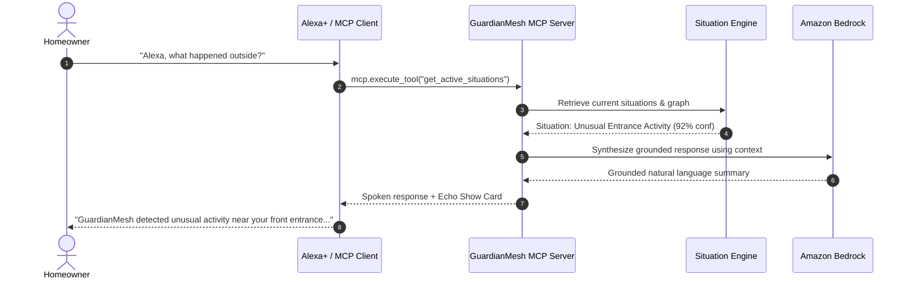

# Alexa+ & Model Context Protocol (MCP) Integration

## Overview
GuardianMesh AI implements a dedicated Model Context Protocol (MCP) server that transforms smart home telemetry into high-level agent tools consumable by Alexa+, AWS Bedrock AgentCore, and external LLM frameworks.

## Natural Language Flow

## Exposed MCP Tools
1. `get_home_status`: Home occupancy mode and perimeter protection state.
2. `get_recent_events`: Raw chronological event streams with confidence levels.
3. `get_active_situations`: Active correlated situations.
4. `get_situation_details`: Deep breakdown of contributing factors and graph topology.
5. `get_device_status`: Battery, Wi-Fi link, and status of connected devices.
6. `get_incident_timeline`: Reconstructed sequence of an incident.
7. `create_incident_report`: Generates and persists an audit-ready security report.
