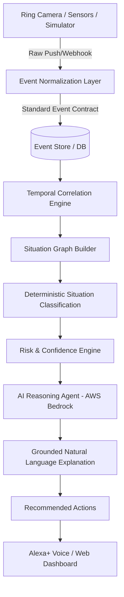

# GuardianMesh AI — Technical Architecture

## Overview
GuardianMesh AI is a smart-home **Situation Intelligence platform**. Unlike conventional smart-home security systems that react to isolated, noisy events (such as "Motion Detected"), GuardianMesh AI extracts and understands the **temporal, spatial, and contextual relationships between events**.

## End-to-End Pipeline

## Core Subsystems

### 1. SmartHomeProvider & Ingestion Layer
An extensible abstraction decoupling physical hardware from algorithmic analysis:
- **`SmartHomeProvider`**: Core interface implementing `get_devices()`, `get_events()`, `subscribe_to_events()`, `send_event()`.
- **`RingProvider`**: Production adapter for Ring OAuth, doorbots, stickup cams, and webhook push ingestion.
- **`SimulatorProvider`**: Deterministic hardware testbed simulating five physical mesh nodes with zero credential dependencies.
- **`RingEventAdapter`**: Maps vendor payloads to the standardized schema.

### 2. Deterministic Situation Engine
Located in `apps/api/app/situation_engine/engine.py`:
- **Temporal Windowing**: 180-second rolling correlation window with sub-second timestamps.
- **Spatial Clustering**: Groups events by geographic zone (e.g. Front Door, Garage, Backyard).
- **False-Positive Noise Filter**: Identifies and suppresses transient foliage or small-animal movements (<15 seconds, isolated single trigger).
- **Home State Contextual Weights**: Contextual modulation based on `Home`, `Away`, `Sleep`, and `Guest` modes.
- **Weighted Confidence Scoring**:
  - Person Detected: 20%
  - Extended Presence (>45s): 25%
  - Repeated Movement: 20%
  - Home Unoccupied: 20%
  - Late-Night Curfew Window: 10%
  - Multi-Sensor Fusion: 5%

### 3. Interactive Situation Graph
Transforms linear logs into directed situational topologies:
- **Nodes**: Situations, Locations, Devices, Events, Contextual States.
- **Edges**: `occurred_near`, `caused_by`, `followed_by`, `correlated_with`, `escalated_to`.

### 4. AI Reasoning Agent & AWS Bedrock
- Grounded contextual synthesis using AWS Bedrock Claude 3.5 Sonnet / Amazon Nova.
- Follows strict safety principles: distinguishes observed facts from probabilistic inferences, never hallucinates criminal charges, and explains reason for alert.
- High-fidelity `MockAIProvider` fallback ensuring offline and local test execution.

### 5. Model Context Protocol (MCP) & Alexa+ Layer
- Standardized MCP server exposing 7 discrete smart-home tools:
  - `get_home_status`
  - `get_recent_events`
  - `get_active_situations`
  - `get_situation_details`
  - `get_device_status`
  - `get_incident_timeline`
  - `create_incident_report`
