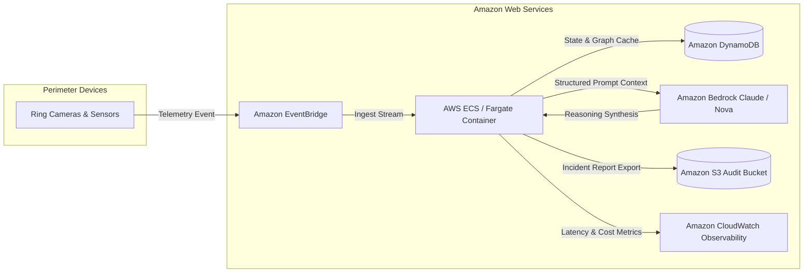

# AWS Architecture & Cloud Services

## Architecture Diagram

## AWS Services Utilized
1. **Amazon Bedrock**:
   - Model: `anthropic.claude-3-5-sonnet-20241022-v2:0` and `amazon.nova-pro-v1:0`
   - Purpose: Grounded reasoning and conversational Q&A over structured event telemetry schemas.
2. **Amazon EventBridge**:
   - Ingestion bus routing telemetry events into the Situation Engine with sub-second latency.
3. **Amazon DynamoDB**:
   - High-throughput low-latency event sourcing and active situation caching.
4. **Amazon S3**:
   - Secure server-side encrypted storage for certified incident reports and audit trails.
5. **Amazon CloudWatch**:
   - Latency, token consumption, and error tracing for AI observability.
